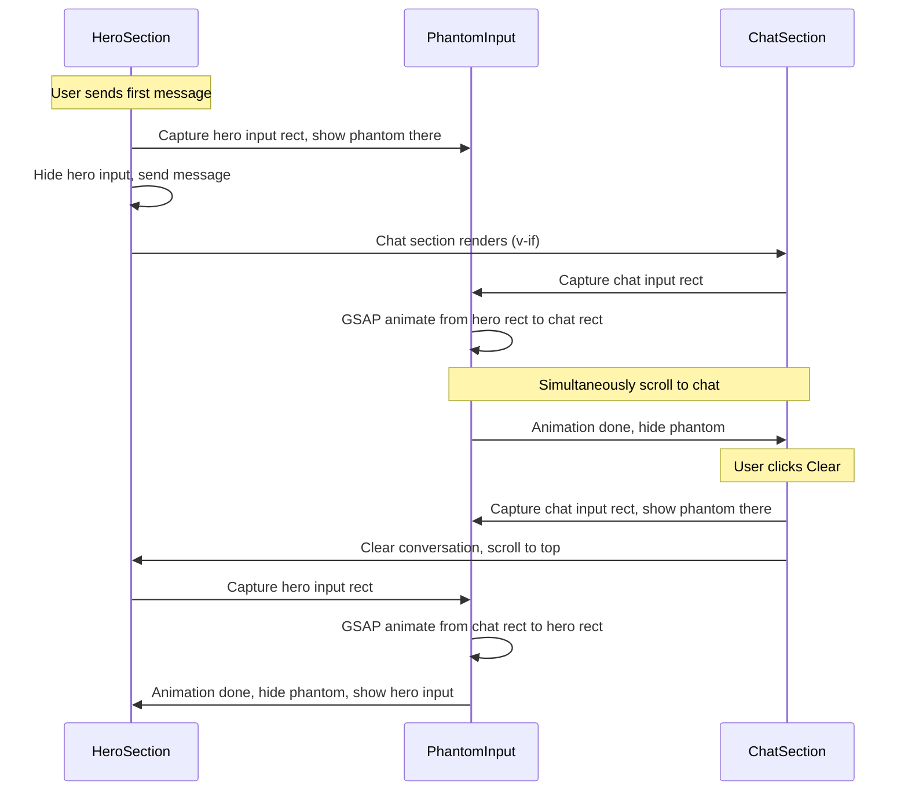

# Chat Input Flight Animation

## Problem

1. Having an input bar on both the hero and the chat page is redundant.
2. The transition between "no chat" and "chat exists" states is jarring -- no visual continuity.

## Design

When the user sends the first message, a phantom (visual-only clone) of the input bar flies upward from the hero to the chat page's input position while the page scrolls up. On clear, the reverse happens. This creates the illusion of the input bar physically relocating.



## Changes

### 1. Revert hero chat area in [pages/index.vue](pages/index.vue)

When `chatHasMessages` is true, show only the scroll-up indicator and the chatty footnote -- no `ChatInput`. When false, show the prompt heading + `ChatInput` + footnote (as before the "always show input" change).

### 2. Add phantom input element in [pages/index.vue](pages/index.vue)

Add a fixed-position, invisible-by-default element at the root of the discovery template that visually matches the `ChatInput` styling (`.chat-input-wrapper` border, border-radius, background). It does not need to be functional -- it is purely decorative for the animation. Give it a `ref="phantomRef"`.

```html
<div
  ref="phantomRef"
  class="phantom-input"
  aria-hidden="true"
>
  <div class="phantom-input__bar" />
</div>
```

CSS (scoped in index.vue):

```css
.phantom-input {
  position: fixed;
  z-index: 9999;
  pointer-events: none;
  opacity: 0;
}
.phantom-input__bar {
  /* Match ChatInput .chat-input-wrapper styles */
  background: rgba(255,255,255,0.8);
  border: 2px solid rgba(0,0,0,0.1);
  border-radius: 12px;
  height: 44px;
}
```

### 3. Expose input wrapper ref from [components/chat/ChatInput.vue](components/chat/ChatInput.vue)

Add a template ref on the outer `<div>` wrapper and expose it via `defineExpose` so the parent can call `chatInputRef.value?.$el` or a custom method to get the `.chat-input-wrapper` bounding rect.

```ts
const wrapperRef = ref<HTMLElement | null>(null)
defineExpose({
  getRect: () => wrapperRef.value?.querySelector('.chat-input-wrapper')?.getBoundingClientRect()
})
```

### 4. Expose ChatInput ref from [components/chat/ChatView.vue](components/chat/ChatView.vue)

Add a template ref on the ChatInput component and expose a `getInputRect()` method via `defineExpose` so `index.vue` can get the chat page input's bounding rect.

```ts
const chatInputComp = ref<InstanceType<typeof ChatInput> | null>(null)
defineExpose({
  getInputRect: () => chatInputComp.value?.getRect?.()
})
```

### 5. Rewrite `handleHeroSend` in [pages/index.vue](pages/index.vue)

The send flow becomes:

```
1. Get hero ChatInput bounding rect
2. Position phantom at that rect, set opacity: 1
3. Hide hero ChatInput (opacity: 0)
4. Send message -> chat section renders via v-if
5. await nextTick x2
6. Get ChatView ChatInput bounding rect
7. GSAP.to(phantom, { top, left, width, duration: 0.6, ease: 'power3.inOut' })
8. Simultaneously GSAP scroll to chat section
9. onComplete: phantom opacity 0, ensure ChatView input is visible
```

### 6. Rewrite `handleChatClear` in [pages/index.vue](pages/index.vue)

The clear flow becomes:

```
1. Get ChatView ChatInput bounding rect
2. Position phantom there, opacity: 1
3. Calculate hero destination (hero will be at top after clear, so input Y is predictable)
4. Clear conversation (removes chat section), snap scroll to top
5. await nextTick x2
6. Get hero ChatInput bounding rect (now rendered)
7. GSAP.to(phantom, { top, left, width, duration: 0.6, ease: 'power3.inOut' })
8. onComplete: phantom opacity 0
```

### 7. Add ScrollTrigger.refresh() calls

Keep the existing `watch(chatHasMessages)` watcher that refreshes ScrollTrigger after DOM settles, but move it to fire after the animation completes (inside `onComplete`) rather than immediately.