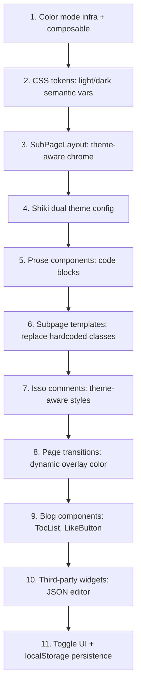

# Light Color Scheme for Subpages -- Effort Evaluation and Plan

## Effort Summary

**Estimated effort: Medium-High (3-5 days)**

The codebase currently has dark colors deeply baked into every layer: CSS custom properties, Tailwind utility classes in templates, hardcoded hex values in scoped styles, Shiki syntax highlighting, third-party widgets (Isso comments, JSON editor), and the page transition system. There is no existing color-mode infrastructure.

---

## Current State Analysis

The entire site is dark-only:

- [`assets/css/main.css`](assets/css/main.css): Base `html` color is `dali-white`, body bg is `#161622`. The `.dali-focus-surface` class (used by `SubPageLayout`) force-overrides everything to white-on-dark with `!important`.
- [`components/layouts/SubPageLayout.vue`](components/layouts/SubPageLayout.vue): Applies `dali-focus-surface`, sets `bodyAttrs.style = 'background-color: #161622'`, topbar bg is `rgba(22, 22, 34, 0.92)`.
- **All subpage templates** (`blogs/[slug].vue`, `tools/*.vue`, `games/[slug].vue`, `about.vue`, `contact.vue`) use dark-scheme Tailwind classes like `text-dali-white`, `bg-dali-smoke`, `border-dali-white/20`, `bg-dali-void` throughout.
- [`components/content/ProsePre.vue`](components/content/ProsePre.vue) and [`ProseGithub.vue`](components/content/ProseGithub.vue): Hardcoded `#1e1e2e` / `#181825` backgrounds.
- [`components/content/ProseCodeInline.vue`](components/content/ProseCodeInline.vue): Hardcoded `rgba(30,30,30,0.8)` bg.
- [`components/content/RepoGithub.vue`](components/content/RepoGithub.vue): Hardcoded `#F0EDE5 !important` colors throughout scoped styles.
- [`components/CommentSection.vue`](components/CommentSection.vue): 50+ `:deep()` rules hardcoded for dark-on-light (neo-black/neo-bg).
- [`components/blog/TocList.vue`](components/blog/TocList.vue): Hardcoded `rgba(240,237,229,...)` light text colors.
- [`components/blog/LikeButton.vue`](components/blog/LikeButton.vue): Uses `text-neo-black/50` (dark text -- would work in light mode but conflict with dark mode context).
- [`nuxt.config.ts`](nuxt.config.ts): Shiki theme is `catppuccin-mocha` (dark only) -- needs dual-theme config.
- [`composables/usePageTransition.ts`](composables/usePageTransition.ts): Hardcoded `DARK_COLOR = '#161622'` as transition target for subpages.

---

## What Needs to Change

### 1. Color Mode Infrastructure (New)

- Install `@nuxtjs/color-mode` (or build a minimal composable like `useTheme`).
- Respect `prefers-color-scheme` as the default, allow manual toggle per page.
- Homepage always stays in "dark" mode; subpages use system preference or user choice.
- Store preference in `localStorage`.

### 2. CSS Token Layer (main.css) -- HIGH effort

- Define a full set of semantic light-mode tokens (background, surface, text, muted, border, shadow).
- Restructure `.dali-focus-surface` (~130 lines of `!important` overrides) to use CSS custom properties that flip per color mode instead of hardcoding `rgba(240,237,229,...)`.
- `.dali-card`, `.dali-btn`, `.dali-input`, `.blog-content` styles all need light variants.
- Approach: Use CSS `:root` + `.dark` class pattern or `@media (prefers-color-scheme)`, scoped to `.sub-page`.

### 3. SubPageLayout -- MEDIUM effort

- [`SubPageLayout.vue`](components/layouts/SubPageLayout.vue): Replace hardcoded `#161622` body bg, topbar bg, glow gradient with theme-aware values.
- Add a color mode toggle button in the topbar.

### 4. Subpage Templates (~8 files) -- HIGH effort

Every subpage template uses dark-specific Tailwind classes. Files needing changes:

| File | Hardcoded dark references |

|------|--------------------------|

| `pages/blogs/[slug].vue `| `text-dali-white` (x8), `bg-dali-smoke`, `border-dali-white/*` |

| `pages/tools/jwt.vue` | `text-dali-white` (x23), `bg-dali-void`, `border-dali-muted/*` |

| `pages/tools/base64.vue` | `text-dali-white` (x3) |

| `pages/tools/json.vue` | `text-dali-white` (x2) |

| `pages/games/[slug].vue `| `text-dali-white` (x7), `border-dali-white/*` |

| `pages/contact.vue` | `text-dali-white` (x16), `border-dali-white/*` |

| `pages/about.vue` | `text-dali-white` (x2) |

Strategy: Replace direct color tokens (`text-dali-white`) with semantic tokens (`text-surface-primary`) that resolve differently per theme, or use `dark:` Tailwind prefix.

### 5. Content/Prose Components -- MEDIUM effort

- [`ProsePre.vue`](components/content/ProsePre.vue): Needs light code block styling (light bg, dark borders). Currently all hardcoded to catppuccin-mocha colors.
- [`ProseCodeInline.vue`](components/content/ProseCodeInline.vue): Needs light variant.
- [`ProseGithub.vue`](components/content/ProseGithub.vue): Needs light variant.
- [`RepoGithub.vue`](components/content/RepoGithub.vue): Already has some neo/light colors but also hardcodes dark colors with `!important`.

### 6. Shiki Dual Theme -- LOW effort but requires config change

- Change Shiki config in [`nuxt.config.ts`](nuxt.config.ts) from single theme (`catppuccin-mocha`) to dual theme:
```
theme: { dark: 'catppuccin-mocha', light: 'catppuccin-latte' }
```

- Add CSS to select the right theme based on color mode class.

### 7. Isso Comments -- HIGH effort

- [`CommentSection.vue`](components/CommentSection.vue) has ~50 `:deep()` rules with hardcoded `var(--color-neo-black)` borders, shadows, text. The component currently assumes a light form (neo-bg background, neo-black text) which actually works for light mode but **contradicts** the dark `.dali-focus-surface` it lives inside.
- Need to rework using theme-aware variables or duplicate rules for dark/light.

### 8. Page Transition -- LOW-MEDIUM effort

- [`usePageTransition.ts`](composables/usePageTransition.ts): `DARK_COLOR` constant used as the overlay target needs to be dynamic (dark or white depending on the target page's active theme).
- [`app.vue`](app.vue): Browser back/forward overlay hardcodes `#161622`.

### 9. Blog-specific Components -- LOW effort

- [`TocList.vue`](components/blog/TocList.vue): Hardcoded `rgba(240,237,229,...)` needs theme-aware values.
- [`AnalyticsDisplay.vue`](components/blog/AnalyticsDisplay.vue): Uses `color: inherit` -- should work if parent is themed.
- [`LikeButton.vue`](components/blog/LikeButton.vue): Uses `text-neo-black/50` which assumes light bg -- needs dark mode variant.

### 10. Third-party: JSON Editor -- LOW effort

- `pages/tools/json.vue` uses `vanilla-jsoneditor` which has its own theming. Needs `darkTheme: false` in light mode.

---

## Recommended Implementation Order



## Risk Areas

- **Flash of wrong theme** during SSR/hydration -- needs `<script>` in `<head>` to set class before paint.
- **Page transitions** between dark homepage and light/dark subpages need careful color interpolation.
- **Isso comments** are injected via external script -- limited control over initial render colors.
- The existing `.dali-focus-surface` approach of using `!important` everywhere will fight with any new theme system and needs to be unwound first.