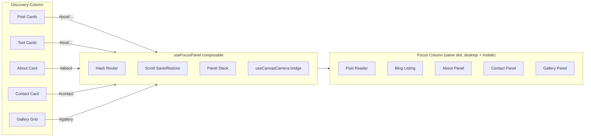

# Universal Focus Panel Abstraction + Blog Redesign

## Problem

The focus-panel pattern is duplicated ad-hoc in [`pages/index.vue`](pages/index.vue): each panel type (post, about, contact, gallery) manually manages hash routing, scroll save/restore, `panToFocus`/`panToDiscovery`, and panel mode switching. Adding "blogs listing" as a new panel type would further bloat this file. Tools pages (`/tools/*`) live as separate routes with no focus integration at all.

## Architecture: Mobile Already Unified

[`DaliCanvas.vue`](components/dali/DaliCanvas.vue) has already absorbed `NeoSlidePanel`. It renders the **same `#focus` slot** in two ways:

- **Desktop**: inline second column (100vw), panned into view via `translateX`
- **Mobile**: Teleported fixed overlay with backdrop + swipe-right-to-dismiss

This means there is **no separate mobile template** to maintain. The `#focus` slot in `index.vue` is the single source of truth for all focus content on all screen sizes. `DaliCanvas` emits `close` when the mobile overlay is dismissed, which `index.vue` handles via `@close="closeAllPanels"`.

## Solution: `useFocusPanel` Composable

Create a single composable that encapsulates the entire focus-panel lifecycle. All panel types register through it, and it handles the shared mechanics.



### Composable API: [`composables/useFocusPanel.ts`](composables/useFocusPanel.ts) (new file)

```typescript
// Core state
activePanel: Ref<PanelType | null>   // 'post' | 'blogs' | 'about' | 'contact' | 'gallery' | null
panelPayload: Ref<any>               // panel-specific data (e.g. BlogPost, GalleryImage)
panelHistory: Ref<PanelEntry[]>      // stack for nested navigation (blogs -> post -> back to blogs)

// Methods
open(type: PanelType, payload?, hash?)  // save scroll, set hash, pan to focus
back()                                   // pop history or close to discovery
close()                                  // full close, restore scroll, clear hash

// Hash routing (auto-wired)
handleHash(hash: string)                 // parse hash, resolve panel + payload, open
syncFromUrl()                            // called on mount for direct URL entry

// Scroll preservation
savedScrollY: number                     // auto-saved before open, auto-restored on close
```

Key behaviors:

- **Panel stack**: `open('blogs')` then `open('post', blogPost)` pushes two entries. `back()` returns to blogs listing. `back()` again returns to discovery. This is the "nested focus" the blog needs.
- **Hash sync**: Each `open()` call pushes a browser history entry. `popstate` calls `back()`. Direct URL entry on mount calls `syncFromUrl()` which parses the hash and opens the right panel.
- **Scroll preservation**: `savedScrollY` is captured on first `open()` and restored on final `close()` (return to discovery).
- **Camera bridge**: Internally calls `panToFocus()` / `panToDiscovery()` from `useCanvasCamera`. On mobile, `panToFocus` still sets `isFocused = true` which triggers `DaliCanvas`'s mobile overlay automatically -- no special mobile handling needed in the composable.
- **DaliCanvas close**: When `DaliCanvas` emits `close` (mobile swipe dismiss), `index.vue` calls `focusPanel.close()` which clears the full stack and restores scroll.

### What Changes in Existing Files

#### [`pages/index.vue`](pages/index.vue)

- Replace all manual panel state (`panelMode`, `activePost`, `selectedGalleryImage`, `openPost()`, `openAbout()`, `openContact()`, `openGallery()`, `closeAllPanels()`, `onPopState()`, hash helpers) with `useFocusPanel()`.
- The single `#focus` slot template switches on `activePanel` instead of `panelMode` / `activePost`. This template serves both desktop and mobile automatically via `DaliCanvas`.
- Add new `'blogs'` panel template: inline blog listing with search, infinite scroll, and `BlogCard` components that call `focusPanel.open('post', post)`.
- `@close="closeAllPanels"` on `DaliCanvas` becomes `@close="focusPanel.close()"`.
- `focusPanelTitle` becomes a computed derived from `activePanel` + `panelPayload`.

#### [`composables/useCanvasCamera.ts`](composables/useCanvasCamera.ts)

- `FocusTarget` type simplified or removed -- the composable no longer needs to know *what* is focused, just that focus is on/off. `useFocusPanel` owns the "what".

#### [`assets/css/main.css`](assets/css/main.css)

- `.dali-focus-surface`: change to `background: transparent` (inherits from canvas viewport) and `color: var(--color-dali-white)`.
- `.blog-content` inside focus: override text colors to bright white, code blocks keep their existing dark-on-light scheme.

#### [`components/blog/BlogCard.vue`](components/blog/BlogCard.vue)

- Replace `navigateTo()` with `emit('select', post)`. The parent (index.vue blog listing) calls `focusPanel.open('post', post)`.

#### [`components/dali/RulerToc.vue`](components/dali/RulerToc.vue)

- Remove `blog-page` mode. Read `activePanel` from `useFocusPanel` to determine TOC behavior (discovery sections vs. post headings).

#### [`components/dali/DaliCanvas.vue`](components/dali/DaliCanvas.vue)

- No changes needed. It already handles both desktop and mobile rendering of the `#focus` slot, and emits `close` for mobile dismiss. The composable works through `useCanvasCamera` which `DaliCanvas` already consumes.

#### Delete standalone blog pages

- Remove `pages/blogs/index.vue`, `pages/blogs/[slug].vue`, `pages/blogs/timeline.vue`, `pages/blogs/tags/` directory.
- Keep `pages/blogs/rss.xml.vue` for RSS feed.

### Blog-Specific Implementation (using the universal abstraction)

1. **"View All Posts" card** on discovery calls `focusPanel.open('blogs', null, 'blogs')`.
2. **Blog listing panel** renders in the focus column: search input, tag filters, infinite-scroll `BlogCard` list. Each card emits `select` which calls `focusPanel.open('post', post, \`post\${post.path}\`)` -- this pushes onto the panel stack.
3. **Back from post** calls `focusPanel.back()` which pops to the blogs listing (scroll position within the listing is preserved via the stack).
4. **Back from blogs listing** calls `focusPanel.back()` which closes focus entirely and restores discovery scroll position.
5. **Direct URL** `#post/blogs/20201002_mecanim`: on mount, `syncFromUrl()` fetches the post by path, pushes `['blogs', 'post']` onto the stack so back still works, and pans to focus.

### Future: Tools Integration (not in this PR)

The same `useFocusPanel` composable can later support `focusPanel.open('tool', { component: 'Base64Tool' }, 'tool/base64')` to render tool UIs inline in the focus column, replacing the current `/tools/*` pages. The abstraction is ready for this without changes.